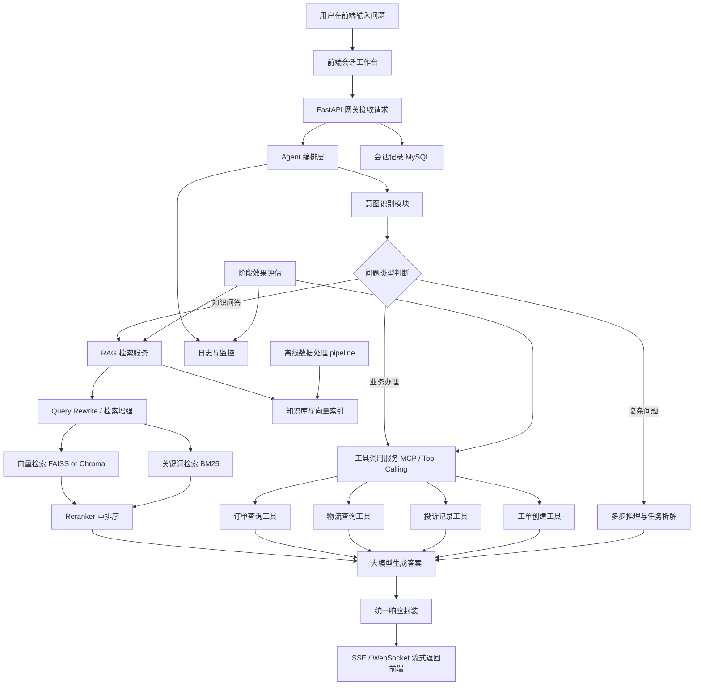
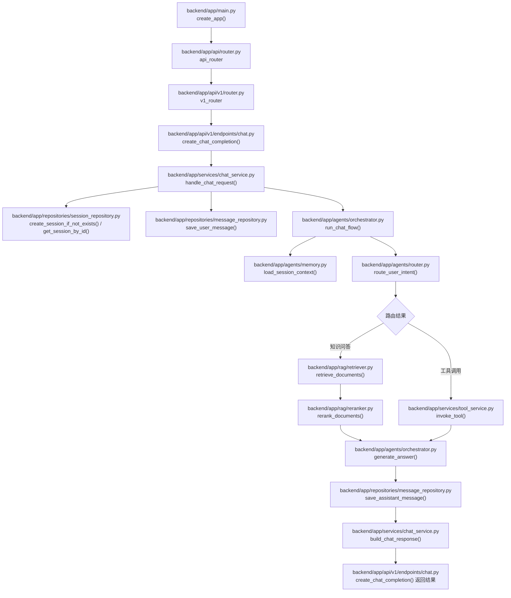
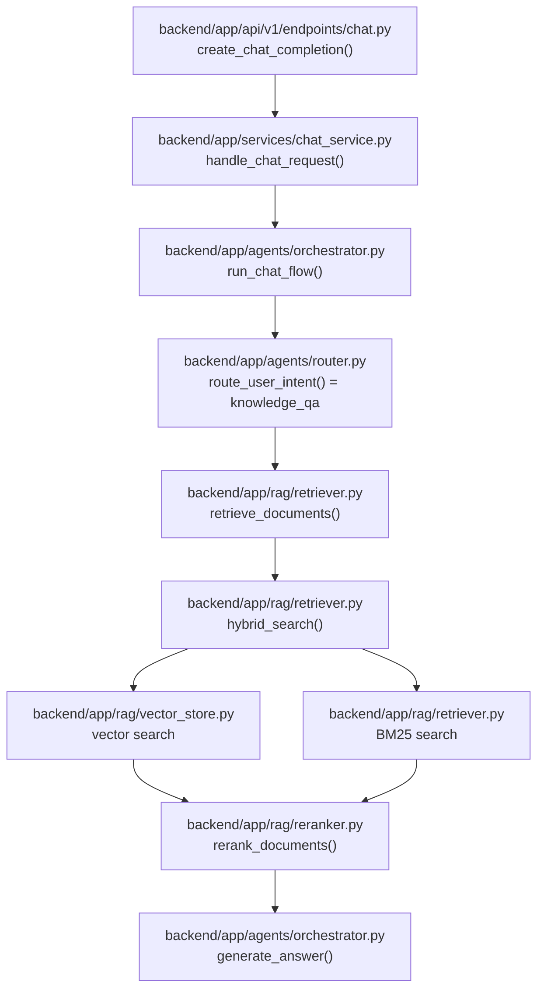
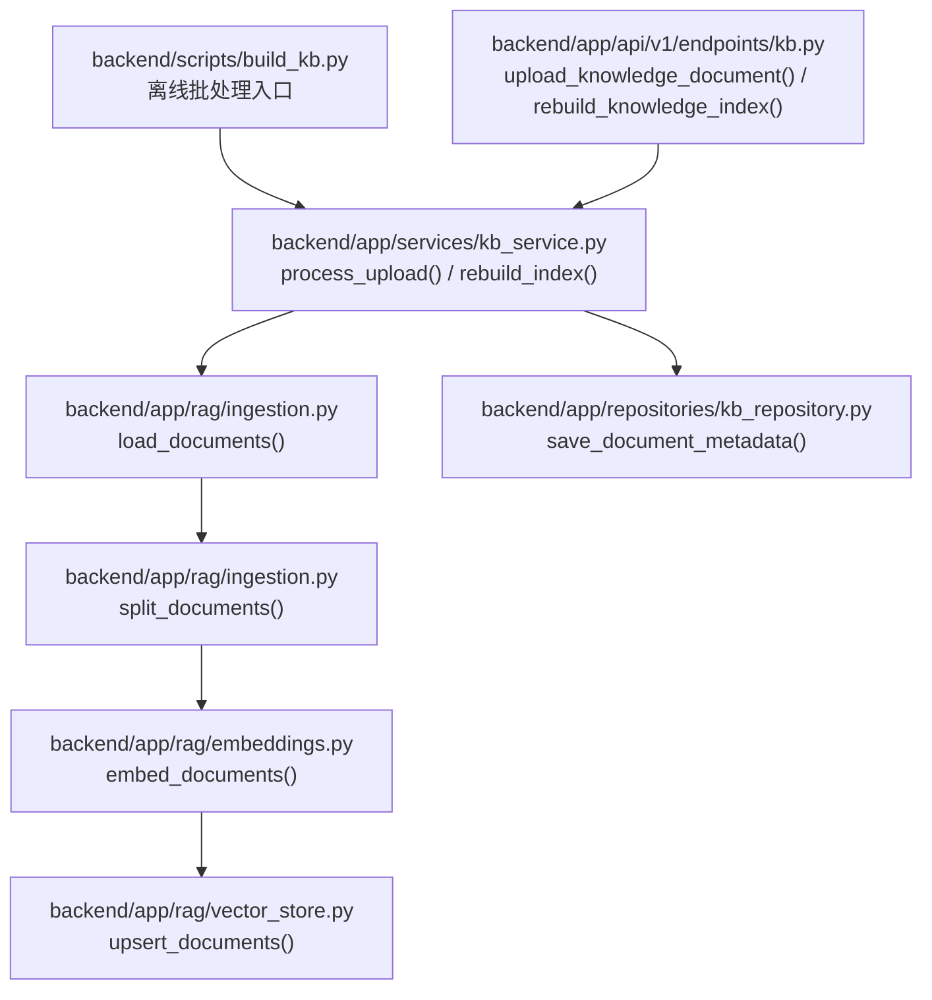
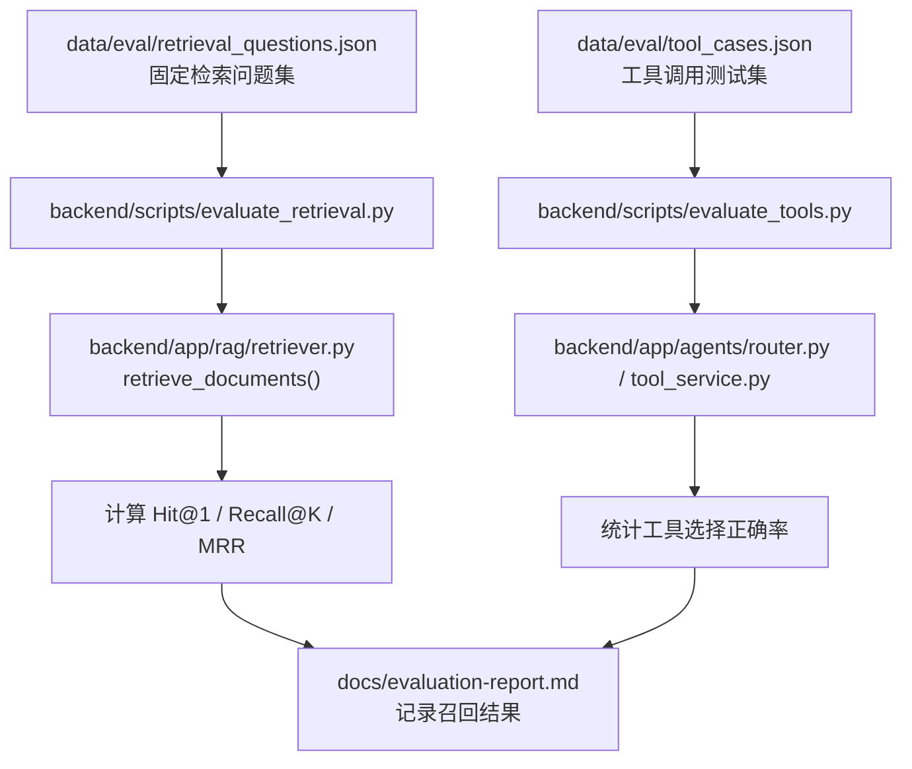
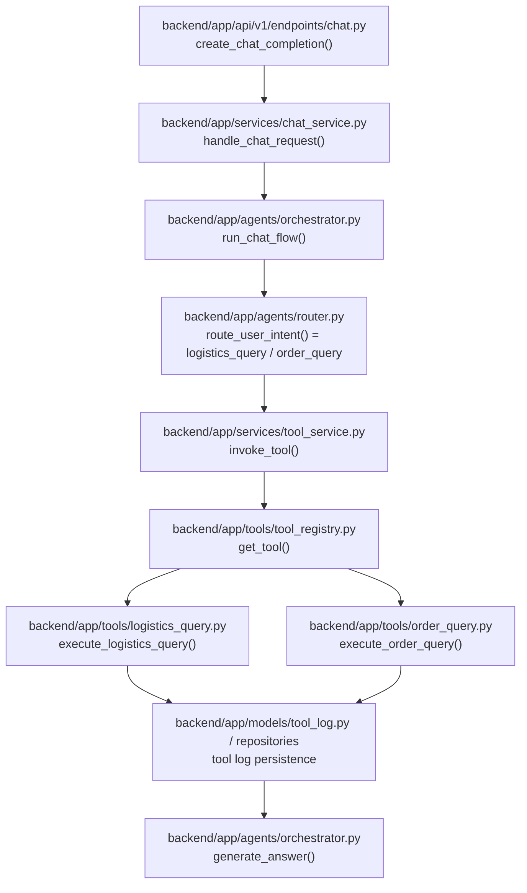

# ServiceMind 项目整体拆分与架构说明

## 1. 项目整体流程图



## 2. 业务流程说明

### 2.1 用户主流程

1. 用户在客服工作台输入问题，例如“我的订单什么时候到？”
2. 前端将当前问题与上下文会话提交给后端网关。
3. 后端 Agent 编排层执行意图识别，判断属于知识咨询、业务查询还是投诉处理。
4. 若为知识型问题，进入 RAG 检索链路；若为业务型问题，进入工具调用链路；若为复杂问题，则进行任务拆解并组合调用。
5. 大模型基于检索结果或工具返回数据生成最终答复。
6. 响应结果流式返回前端，同时写入会话日志、检索日志和工具调用日志。

### 2.2 数据流向

- `用户问题 -> FastAPI -> Agent 编排层`
- `Agent 编排层 -> RAG 检索服务 -> 向量库/BM25 -> 检索结果`
- `Agent 编排层 -> MCP 工具服务 -> 业务系统 -> 业务结果`
- `检索结果/业务结果 -> LLM -> 最终回复`
- `会话记录/日志/埋点 -> MySQL + 日志系统`
- `原始知识文档 -> 离线清洗/切分/embedding -> 向量索引/元数据`
- `固定评估问题集 -> 检索/回答/工具调用链路 -> 阶段验证报告`

### 2.3 核心模块交互逻辑

- 前端负责展示、输入、流式渲染与客服工作台交互。
- API 网关负责鉴权、请求校验、会话组装与响应格式统一。
- Agent 编排层负责意图识别、工具选择、上下文记忆和执行链路编排。
- RAG 服务负责文档切分、向量化、召回、重排序和上下文拼接。
- 工具层负责与订单、物流、工单、投诉等业务系统交互。
- 数据层负责持久化会话、用户反馈、检索日志与系统配置。
- 离线数据处理层负责批量构建知识库，避免所有解析、切分和向量化都挤在用户请求链路中。
- 阶段评估层负责用固定测试集验证 RAG、Prompt 和 Agent 工具调用策略，结果沉淀到 [evaluation-report.md](/D:/pythoncode/ServiceMind/docs/evaluation-report.md)。

## 3. 文件级与函数级实现视图

这一节的目的，是让你不只知道“模块怎么交互”，还知道“一个功能最终要落到哪些文件、哪些函数”。

### 3.1 当前骨架中已经存在的入口函数

目前代码仓库里已经存在的函数入口主要有：

- [backend/app/main.py](/D:/pythoncode/ServiceMind/backend/app/main.py)
  - `create_app()`
- [backend/app/api/v1/endpoints/health.py](/D:/pythoncode/ServiceMind/backend/app/api/v1/endpoints/health.py)
  - `health_check()`
- [backend/app/api/v1/endpoints/chat.py](/D:/pythoncode/ServiceMind/backend/app/api/v1/endpoints/chat.py)
  - `create_chat_completion()`
- [backend/app/api/v1/endpoints/sessions.py](/D:/pythoncode/ServiceMind/backend/app/api/v1/endpoints/sessions.py)
  - `get_session_detail()`
- [backend/app/api/v1/endpoints/kb.py](/D:/pythoncode/ServiceMind/backend/app/api/v1/endpoints/kb.py)
  - `upload_knowledge_document()`
  - `rebuild_knowledge_index()`
- [backend/app/api/v1/endpoints/tools.py](/D:/pythoncode/ServiceMind/backend/app/api/v1/endpoints/tools.py)
  - `query_order_tool()`
  - `query_logistics_tool()`
  - `create_complaint_tool()`

这些函数当前还是占位实现，但已经明确了后续功能入口应该落在哪些文件。

### 3.2 推荐补齐的核心函数

为了让后续开发可控，建议按下列文件继续补函数：

- [backend/app/services/chat_service.py](/D:/pythoncode/ServiceMind/backend/app/services/chat_service.py)
  - `handle_chat_request()`
  - `build_chat_response()`
- [backend/app/agents/orchestrator.py](/D:/pythoncode/ServiceMind/backend/app/agents/orchestrator.py)
  - `run_chat_flow()`
  - `generate_answer()`
- [backend/app/agents/router.py](/D:/pythoncode/ServiceMind/backend/app/agents/router.py)
  - `route_user_intent()`
- [backend/app/agents/memory.py](/D:/pythoncode/ServiceMind/backend/app/agents/memory.py)
  - `load_session_context()`
  - `save_session_context()`
- [backend/app/rag/retriever.py](/D:/pythoncode/ServiceMind/backend/app/rag/retriever.py)
  - `retrieve_documents()`
  - `hybrid_search()`
- [backend/app/rag/reranker.py](/D:/pythoncode/ServiceMind/backend/app/rag/reranker.py)
  - `rerank_documents()`
- [backend/app/services/tool_service.py](/D:/pythoncode/ServiceMind/backend/app/services/tool_service.py)
  - `invoke_tool()`
- [backend/app/tools/tool_registry.py](/D:/pythoncode/ServiceMind/backend/app/tools/tool_registry.py)
  - `get_tool()`
- [backend/app/tools/logistics_query.py](/D:/pythoncode/ServiceMind/backend/app/tools/logistics_query.py)
  - `execute_logistics_query()`
- [backend/app/tools/order_query.py](/D:/pythoncode/ServiceMind/backend/app/tools/order_query.py)
  - `execute_order_query()`
- [backend/app/repositories/message_repository.py](/D:/pythoncode/ServiceMind/backend/app/repositories/message_repository.py)
  - `save_user_message()`
  - `save_assistant_message()`
- [backend/app/repositories/session_repository.py](/D:/pythoncode/ServiceMind/backend/app/repositories/session_repository.py)
  - `get_session_by_id()`
  - `create_session_if_not_exists()`

上面这些函数名是推荐命名，不是强制标准；但建议你尽量按这个约定实现，这样文档、代码和流程图能保持一致。

### 3.3 回答功能文件级流程图

这个流程图描述的是“用户发起一次问答请求，系统最终返回回答”的完整主链路。



### 3.4 检索问答功能函数组合说明

当用户问的是知识库类问题，例如“7 天无理由退货规则是什么？”，建议按下面这条链路实现：

1. [backend/app/api/v1/endpoints/chat.py](/D:/pythoncode/ServiceMind/backend/app/api/v1/endpoints/chat.py) 中的 `create_chat_completion()`
   - 接收请求
   - 调用 `chat_service.handle_chat_request()`
2. [backend/app/services/chat_service.py](/D:/pythoncode/ServiceMind/backend/app/services/chat_service.py) 中的 `handle_chat_request()`
   - 保存用户消息
   - 调用 `orchestrator.run_chat_flow()`
3. [backend/app/agents/orchestrator.py](/D:/pythoncode/ServiceMind/backend/app/agents/orchestrator.py) 中的 `run_chat_flow()`
   - 读取上下文
   - 调用 `route_user_intent()`
4. [backend/app/agents/router.py](/D:/pythoncode/ServiceMind/backend/app/agents/router.py) 中的 `route_user_intent()`
   - 判断该问题属于知识问答
5. [backend/app/rag/retriever.py](/D:/pythoncode/ServiceMind/backend/app/rag/retriever.py) 中的 `retrieve_documents()`
   - 从向量库和 BM25 召回相关片段
6. [backend/app/rag/reranker.py](/D:/pythoncode/ServiceMind/backend/app/rag/reranker.py) 中的 `rerank_documents()`
   - 对召回结果重排
7. [backend/app/agents/orchestrator.py](/D:/pythoncode/ServiceMind/backend/app/agents/orchestrator.py) 中的 `generate_answer()`
   - 把上下文和检索结果组装进 Prompt，生成最终回复
8. [backend/app/repositories/message_repository.py](/D:/pythoncode/ServiceMind/backend/app/repositories/message_repository.py) 中的 `save_assistant_message()`
   - 把回复写回消息表

### 3.5 检索功能文件级流程图

这个流程图只聚焦“知识检索”本身，不展开 chat 的其他环节。



### 3.6 知识库构建功能文件级流程图

这个流程图对应的是“导入文档并构建检索索引”的离线流程。



### 3.7 阶段评估功能文件级流程图

阶段评估不服务于单个用户请求，而服务于项目持续迭代。每次调整检索策略、Prompt 或 Agent 路由后，都应使用固定测试集复跑。



### 3.8 工具调用功能文件级流程图

当用户问的是订单或物流类问题时，推荐走下面这条文件链路。



## 4. 核心功能实现方案

### 4.1 对话管理模块

#### 功能定位

- 承载用户多轮对话
- 维护上下文记忆
- 统一管理会话状态

#### 技术实现思路

- 前端使用 `Vue 3 + TypeScript + Vue Router + Pinia + Axios` 构建聊天工作台，当前支持消息列表、快捷入口、健康检查、会话与 trace 展示；流式输出作为后续增强。
- 后端使用 FastAPI 提供 `/chat`、`/session/history` 等接口。
- 会话上下文采用 `Redis + MySQL` 双层存储：
  - Redis 保留短期上下文，降低读取延迟
  - MySQL 持久化全量会话与审计记录

#### 关键逻辑

- 根据 `session_id` 聚合历史消息
- 控制上下文窗口长度，避免 token 失控
- 对敏感信息进行脱敏与日志隔离

### 4.2 意图识别与路由模块

#### 功能定位

- 判断用户问题属于 FAQ、订单、物流、投诉、售后等哪类场景
- 为后续执行链路做路由分发

#### 技术实现思路

- 第一阶段使用 `规则 + 关键词 + Prompt 分类`
- 后续可基于标注语料训练轻量分类器，或通过 LoRA 微调客服领域模型

#### 关键逻辑

- 识别用户主诉求与槽位信息，例如订单号、手机号、投诉对象
- 决定是否需要调用外部工具
- 决定是否需要进入知识库检索链路

### 4.3 RAG 知识检索模块

#### 功能定位

- 解决商品说明、平台规则、售后政策等知识问答问题

#### 技术实现思路

- 文档导入：支持 PDF、Word、Markdown、TXT、HTML
- 文档预处理：清洗、去重、分段、元数据打标
- 当前 MVP 已落地 TXT/Markdown/接口文本的清洗、长度分块、FAISS 本地向量索引、词法回退和来源返回
- 建索引：
  - 当前使用 `data/vector_store/servicemind.faiss` 保存 FAISS 索引
  - 当前使用 `data/vector_store/metadata.json` 保存向量与知识片段元数据映射
  - 词法检索用于 FAISS 不可用、索引未命中或索引与数据库不同步时兜底
  - 后续可补 BM25 用于关键词精准匹配
- 在线检索：
  - 优先走 FAISS 向量召回
  - 向量召回失败或无有效命中时回退词法检索
  - 后续补 query rewrite、混合召回和 rerank 重排序
  - 上下文压缩后送入 LLM

#### 关键逻辑

- 保证知识片段带来源标识，便于可追溯
- 聊天响应通过 `knowledge_sources` 返回命中的 `document_id`、标题、来源类型、来源路径、分数和片段
- 控制召回片段数量，兼顾效果与成本
- 对低置信度结果增加兜底策略，例如转人工或提示未命中知识

### 4.4 MCP 工具调用模块

#### 功能定位

- 让 Agent 能处理真实业务，而不仅是聊天

#### 技术实现思路

- 使用 MCP 或统一 Tool Registry 管理可调用工具
- 每个工具独立定义：
  - 输入参数 schema
  - 权限校验
  - 调用逻辑
  - 异常处理

#### 关键逻辑

- 订单查询工具：根据订单号或手机号查询订单状态
- 物流跟踪工具：获取物流节点与预计送达时间
- 投诉记录工具：查询历史投诉、避免重复提单
- 工单创建工具：将复杂问题升级给人工客服或售后系统

### 4.5 模型微调模块

#### 功能定位

- 让模型更贴近客服语境、回复风格和业务流程

#### 技术实现思路

- 基座模型可选 `Qwen3-1.7B` 或同等级中文指令模型
- 使用 `LoRA + PEFT` 进行参数高效微调
- 数据集来自历史客服问答、FAQ、工单记录和人工标注数据

#### 关键逻辑

- 清洗脏数据、统一角色格式
- 标注意图类别、标准答法、拒答策略
- 通过离线评测比较微调前后在客服任务上的命中率和稳定性

### 4.6 日志监控与运营模块

#### 功能定位

- 支撑系统上线后的可观测性和持续优化

#### 技术实现思路

- 记录检索命中率、工具调用成功率、回复耗时、人工转接率
- 结合 Prometheus + Grafana 做仪表盘
- 将错误样本沉淀到优化样本池

#### 关键逻辑

- 为每轮对话生成 `trace_id`
- 串联请求、检索、工具、模型输出各阶段日志
- 支撑问题复盘和效果迭代

## 5. 核心接口建议

```text
POST   /api/chat
GET    /api/session/{session_id}
POST   /api/kb/upload
POST   /api/kb/rebuild
POST   /api/tools/order-query
POST   /api/tools/logistics-query
POST   /api/tools/complaint-create
GET    /api/metrics/overview
```

## 6. 推荐落地顺序

1. 先打通聊天主链路与基础知识问答
2. 再接入订单和物流两个高频工具
3. 随后补充投诉与工单升级
4. 最后引入微调、监控看板和更完整的运营能力
